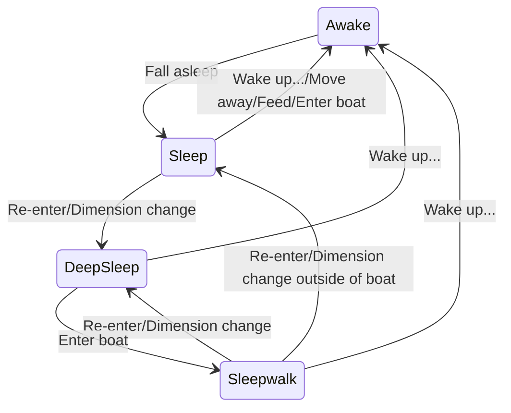

# sleepwalk

A shallow dive into Minecraft villagers' "sleepwalk" trait. Content marked with `?` is unverified. Related video (in Chinese):

- [[Minecraft] A town portal based on "sleepwalk"](https://www.bilibili.com/video/BV1gmr8YmES8/)

Demo world (in Chinese) can be downloaded from [Releases](https://github.com/PRO-2684/sleepwalk/releases), and 1.21.3+ is recommended for playing.

## Villager states

| State  | Model  | Interaction/Sound | Occupy bed  |
| --- | --- | ----- | --- |
| Awake  | Standing  | ✔️    | ✖️  |
| Sleep  | Lying  | ✖️    | ✔️  |
| Deep sleep  | Lying  | ✖️    | ✔️  |
| Sleepwalk  | Standing  | ✖️    | ✔️  |

### Awake

Villagers' normal state during the day.

### Sleep

Villagers' normal state after falling asleep at night. Will wake up if they move a certain distance away from the bed or enter a boat.

### Deep sleep

Villagers will enter deep sleep if the player re-enters the world/dimension while they are in the sleep state, provided that the chunk they are in is unloaded. They will not wake up if they move away from the bed, but will be teleported to the vicinity of the bed after re-entering/crossing dimensions. In this state, villagers will not enter a portal.

### Sleepwalk

Villagers will enter the sleepwalk state if they enter a boat while in deep sleep, and will remain in this state when they leave the boat. If the player re-enters the world/dimension while the villager is not in the boat, they will be teleported to the bed and enter the sleep state. In this state, villagers will try to return to the original bed. If the path is blocked, they will try to sleep in another bed. If successful, the original bed will remain occupied, but other villagers will continue to try to occupy it. In this state, villagers will wake up if they cross dimensions, but the bed will not be released and can only be released by breaking and replacing it.

## Transition diagram

## Damage

- While in deep sleep?/sleepwalk state
- Injured/frightened? villagers
- If the chunk containing the occupied bed is unloaded? and the villager is not in a boat
- They will be teleported to the vicinity of the occupied bed, enter the awake state, and release the bed
- If injured while in a boat:
    - When the bed is not loaded, they will be teleported to the vicinity of the bed, and then back to the boat 2 ticks after the bed is loaded
    - When the bed is loaded, they will not be teleported to the vicinity of the bed, but the injury sound will play from the bed

## Awakening

As we all know, right-clicking on a bed can wake up a villager and claim the bed, but in reality, the villager awakened is not the one occupying the bed. When right-clicking on a bed, if there is a villager very close to the bed, that villager will be awakened and the bed it has occupied will be released; otherwise, a message will be displayed indicating that the bed is already occupied, and nothing will happen.

The result of multiple villagers being awakened by the same bed has not been observed.
