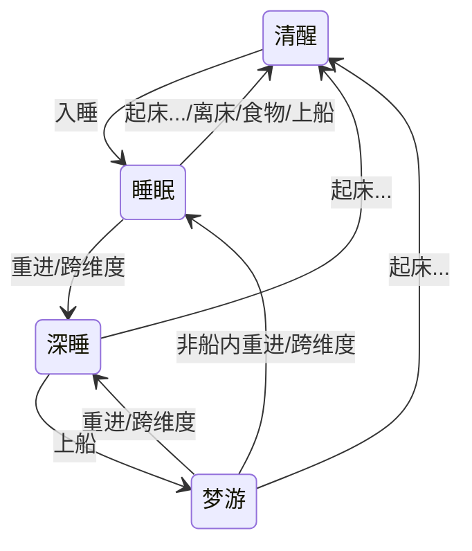

# 梦游

浅析 Minecraft 村民的“梦游”特性。标有 `?` 的为未验证的内容。相关视频：

- [[Minecraft] 基于“梦游”的一键回城装置](https://www.bilibili.com/video/BV1gmr8YmES8/)

测试存档可以在 [Releases](https://github.com/PRO-2684/sleepwalk/releases) 中下载，建议使用 1.21.3+ 版本游玩。

## 村民的状态

| 状态  | 模型  | 交互/声音 | 占床  |
| --- | --- | ----- | --- |
| 清醒  | 站立  | ✔️    | ✖️  |
| 睡觉  | 平躺  | ✖️    | ✔️  |
| 深睡  | 平躺  | ✖️    | ✔️  |
| 梦游  | 站立  | ✖️    | ✔️  |

### 清醒 (awake)

白天时村民的正常状态。

### 睡眠 (sleep)

晚上村民入睡后的正常状态。离开床一定距离或进入船后会转为清醒状态。

### 深睡 (deep sleep)

村民在睡觉状态下，玩家重进存档/维度后村民会进入深睡状态（需保证所在区块被卸载）。离开床任意距离均不会清醒。

### 梦游 (sleepwalk)

村民在深睡状态下进入船则转变为梦游状态，离开船时维持梦游状态。若在离开船的情况下重进存档/维度，则传送至床并转为睡觉状态。此状态下村民会尝试回到原来的床附近，若路径被阻挡，则会尝试在其它床上进入睡觉状态；若成功，原来的床保持被占用，但是其它村民会一直尝试占用这张床。

## 转换图

## 受伤

- 深睡?/梦游状态下
- 受伤/受惊?的村民
- 若占用的床所在区块未加载?，并且不在船内
- 则立即传送至占用的床附近，进入清醒状态并解除占用
- 若在船内受伤：
    - 当床未被加载时，将会被传送至床附近，床加载 2 tick 之后再次传送回船内
    - 当床已被加载时，不会被传送至床附近，但是受伤音效是从床上播放的

## 唤醒

众所周知，右键床可以唤醒村民然后抢床，但是实际上唤醒的不是占用这张床的村民。当右键床时，若床极近的位置有村民，则唤醒此村民并解除其占用的床；若无，则会提示床已被占用，无事发生。

暂未发现同一张床唤醒到多个村民的结果。
